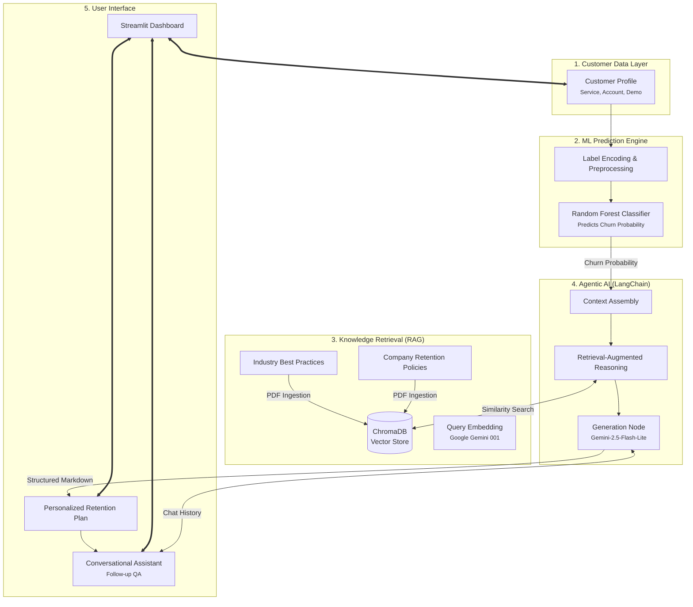

# Agentic Customer Retention Assistant 📊🤖

A professional-grade, hybrid AI system that combines **Classic Machine Learning** with **Agentic RAG (Retrieval-Augmented Generation)** to predict customer churn and provide autonomous, evidence-based retention strategies in real-time.

---

## 🌟 Project Overview

This system goes beyond standard churn prediction by evolving into a sophisticated **Retention Strategist Agent**. It operates in two primary phases:

1.  **ML Churn Prediction Engine**: A high-performance **Random Forest Classifier** that analyzes customer demographics, account details, and service usage to calculate an accurate churn probability.
2.  **Agentic AI Reporting (RAG)**: A LangChain-orchestrated workflow that retrieves localized retention best practices and company policies to generate personalized, actionable health reports for high-risk customers.

---

## 🏗️ System Architecture



---

## 🚀 Key Features

- **Hybrid Retention Pipeline**: Combines statistical churn modeling with discrete classification for a nuanced customer perspective.
- **Evidence-Based RAG**: Unlike generic LLMs, this agent grounds its advice in a verified knowledge base of retention strategies, citing specific policies directly.
- **Explainable AI**: Provides clear reasoning for why a customer is likely to churn and what specific offers are most likely to retain them.
- **Conversational Follow-ups**: A stateful chat interface allows business managers to ask clarifying questions (e.g., "What specific offer can I give to reduce their monthly bill?").
- **Modern UI**: Implemented with a sleek, responsive Streamlit interface and custom CSS for a premium feel.

---

## 🛠️ Tech Stack

- **Orchestration**: LangChain
- **LLM Engine**: Google Gemini-2.5-Flash-Lite
- **Vector Database**: ChromaDB
- **Embeddings**: Google Gemini (`gemini-embedding-001`)
- **ML Frameworks**: Scikit-Learn, Pandas, NumPy
- **Frontend**: Streamlit + Custom CSS
- **Deployment**: Streamlit Cloud

---

## 📂 Project Structure

```text
├── data/                       # Raw customer datasets (Telco Churn)
├── models/                     # Serialized ML models (model.pkl)
├── rag/                        # RAG & Vector Store Implementation
│   ├── pdf_loader.py           # Document ingestion logic
│   └── vector_store.py         # ChromaDB setup and retrieval
├── knowledge/                  # Strategy PDFs & Knowledge Base
├── report/                     # Evaluation metrics & final reports
├── utils/                      # Agent & LLM helper functions
├── notebook/                   # EDA & Model Training Notebooks
├── app.py                      # Main Streamlit Dashboard
├── requirements.txt            # System dependencies
└── README.md
```

---

## ⚙️ Getting Started

Follow these steps to set up and run the project locally.

### 1. Prerequisites
- Python 3.9 or higher
- A Google AI Studio API Key (for Gemini)

### 2. Installation

1.  **Clone the Repository**:
    ```bash
    git clone https://github.com/Kaustubh0505/Customer-Churn-Prediction-ML.git
    cd Customer-Churn-Prediction-ML
    ```

2.  **Create a Virtual Environment**:
    ```bash
    python -m venv venv
    source venv/bin/activate  # On Windows: venv\Scripts\activate
    ```

3.  **Install Dependencies**:
    ```bash
    pip install -r requirements.txt
    ```

### 3. Configuration

1.  **Environment Variables**:
    Create a `.env` file in the root directory and add your Google API key:
    ```bash
    GOOGLE_API_KEY=your_google_api_key_here
    ```
    *You can get your API key from the [Google AI Studio](https://aistudio.google.com/app/apikey).*

---

## 👥 Team Members

- **Rudraksh Rathod** - 2401010396
- **Kaustubh Hiwanj** - 2401010217
- **Bhargav Patil** - 2401020092

---
*📊 **Disclaimer**: This tool is designed for business decision support and informational purposes. Performance depends on the quality of historical data and the provided strategy knowledge base.*
